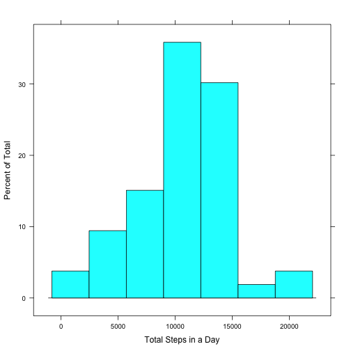
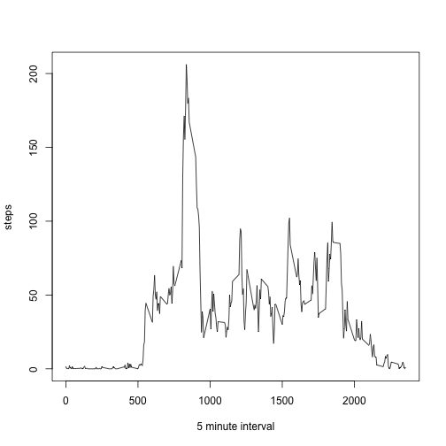
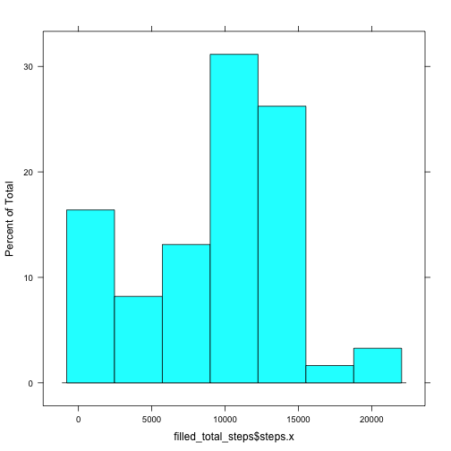
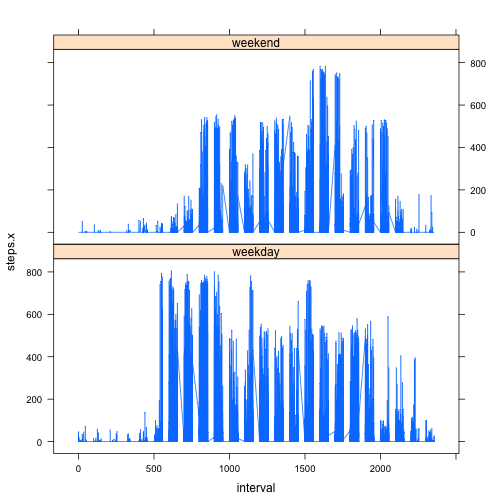

####Loading and preprocessing the data

1. Load the data (i.e. read.csv())


```r
#standard csv load
activity<-read.csv('activity.csv')

#format inline output of median and mean below
options(scipen = 1, digits = 2)
```

####What is mean total number of steps taken per day?

1. What is mean total number of steps taken per day? Ignore the missing values in the dataset.

```r
#load dplyr for aggregate
library(dplyr)
#omit the NAs as per instructions
clean_act<-na.omit(activity)
#aggregate sum of total steps by date
total_steps<-aggregate(steps ~ date,data=clean_act,FUN =sum)
summary(total_steps)
```

```
##          date        steps      
##  2012-10-02: 1   Min.   :   41  
##  2012-10-03: 1   1st Qu.: 8841  
##  2012-10-04: 1   Median :10765  
##  2012-10-05: 1   Mean   :10766  
##  2012-10-06: 1   3rd Qu.:13294  
##  2012-10-07: 1   Max.   :21194  
##  (Other)   :47
```
2. Make a histogram of the total number of steps taken each day

```r
library(lattice)
histogram(total_steps$steps,xlab='Total Steps in a Day')
```

 

3. Calculate and report the mean and median of the total number of steps taken per day


```r
mn<-mean(total_steps$steps)
md<-median(total_steps$steps)
```

*The mean of total steps per day 10766.19*

*The median total steps per day 10765*

####What is the average daily activity pattern?

1. Make a time series plot of the 5-minute interval and the average number of steps taken, averaged across all days (y-axis)

```r
#group the data by interval
time_series<-group_by(clean_act,interval)
#calculate the mean for each interval across all days
mean_interval<-summarise(time_series,steps=mean(steps))
#display time series plot
plot(mean_interval,type="l",xlab='5 minute interval')
```

 

2. Which 5-minute interval, on average across all the days in the dataset, contains the maximum number of steps?

```r
#locate the row with the maximum value for mean
mi<-mean_interval[mean_interval$steps==max(mean_interval$steps),]
```
*The 835 interval has the maximum average of 206.17*

####Imputing missing values

Calculate and report the total number of missing values in the dataset (i.e. the total number of rows with NAs)

```r
num_na<-sum(is.na(activity$steps))
```
*The number of missing readings is 2304 of 17568 total readings.*

Devise a strategy for filling in all of the missing values in the dataset. The strategy does not need to be sophisticated. 

*I will use median for a given 5-minute interval across all days as my fill in value.
The number of steps has a stronger relationship to the interval than the day.  Also the median is the same variable type as steps, whereas the mean will be a floating point number.*

Create a new dataset that is equal to the original dataset but with the missing data filled in.


```r
#calculate the mendian for each interval across all days
median_interval<-summarise(time_series,steps=median(steps))
#merge the median for the interval with the activity dataframe such that the median for each row is in a column of that row
m_activity<-merge(activity,median_interval,by='interval')
#if the reading for the interval is NA,t than replace the NA with the median
m_activity[is.na(m_activity$steps.x),]$steps.x=m_activity[is.na(m_activity$steps.x),]$steps.y
```

Compare the original and the merged table showing the NA replaced with the median (in this case 0)


```r
head(activity)
```

```
##   steps       date interval
## 1    NA 2012-10-01        0
## 2    NA 2012-10-01        5
## 3    NA 2012-10-01       10
## 4    NA 2012-10-01       15
## 5    NA 2012-10-01       20
## 6    NA 2012-10-01       25
```

```r
head(arrange(m_activity,date))
```

```
##   interval steps.x       date steps.y
## 1        0       0 2012-10-01       0
## 2        5       0 2012-10-01       0
## 3       10       0 2012-10-01       0
## 4       15       0 2012-10-01       0
## 5       20       0 2012-10-01       0
## 6       25       0 2012-10-01       0
```

Make a histogram of the total number of steps taken each day and Calculate and report the mean and median total number of steps taken per day.


```r
filled_total_steps<-aggregate(steps.x ~ date,data=m_activity,FUN =sum)
histogram(filled_total_steps$steps.x)
```

 


```r
fmn<-mean(filled_total_steps$steps.x)
fmd<-median(filled_total_steps$steps.x)
```

*The mean for the filled dataset is 9503.87 and the median is 10395.*

*The mean of the original dataset is 10766.19 and the median is 10765.*

Do these values differ from the estimates from the first part of the assignment? What is the impact of imputing missing data on the estimates of the total daily number of steps?

*Adding the missing data lowers the mean and median values.  THe original values for mean and median are too high because they have a greater impact on the average and median if the value is distributed over a lower number of values.*


####Are there differences in activity patterns between weekdays and weekends?
Create a new factor variable in the dataset with two levels – “weekday” and “weekend” indicating whether a given date is a weekday or weekend day.


```r
#add a column that has a factor of weekday/weekend to seperate out weekend data
m_activity$weekday<-m_activity$weekend<-factor(weekdays(as.Date(m_activity$date)) %in% c('Sunday','Saturday'),labels=c('weekday','weekend'))
```

Make a panel plot containing a time series plot (i.e. type = "l") of the 5-minute interval (x-axis) and the average number of steps taken, averaged across all weekday days or weekend days (y-axis).  


```r
 xyplot( steps.x ~ interval|weekday,m_activity,type='l',layout=c(1,2))
```

 


